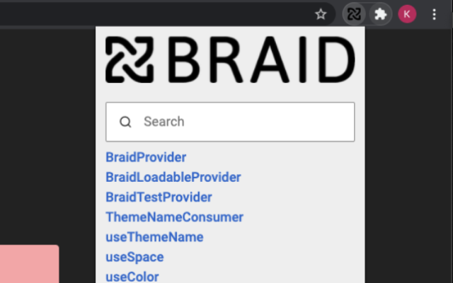

# Braid Lookup

This repo builds and deploys a simple chrome and firefox extension for searching braid components.



This project is powered by [sku](https://github.com/seek-oss/sku), [braid](https://github.com/seek-oss/braid-design-system) and built with [React](https://facebook.github.io/react).

## Links

[Chrome Web Store](https://chrome.google.com/webstore/detail/braid-lookup-extension/djejlpbhhhhidocammjkigbcpdcggmgj)

[Firefox Addon](https://addons.mozilla.org/en-US/firefox/addon/braid-lookup-extension)

## Getting Started

First of all, make sure you&#39;ve installed [Yarn](https://yarnpkg.com).

Then, install dependencies:

```bash
$ yarn
```

## Workflow

Start a local development server:

```bash
$ yarn start
```

Run unit tests:

```bash
$ yarn test
```

Lint and format code:

```bash
$ yarn lint
$ yarn format
```

Build assets for production:

```bash
$ yarn build
```

Zip folders to be uploaded to chrome and firefox:

```bash
$ yarn build-zip
```

## Releasing updates

The code is automatically released using github Actions.
Raise a PR from master to release branch to create a new release

# INSTRUCTIONS FOR FIREFOX

To create signed xpi file.

1. Requires Mozilla API key and secret.
1. Requires node and yarn and nvm
1. Run

```
nvm use
yarn
yarn build
yarn web-ext sign --api-key $MOZILLA_SECRET_KEY --api-secret $MOZILLA_SECRET_VALUE --channel unlisted -s dist
```

xpi file should be in `web-ext-artifacts/braid_lookup_extension-....xpi`
